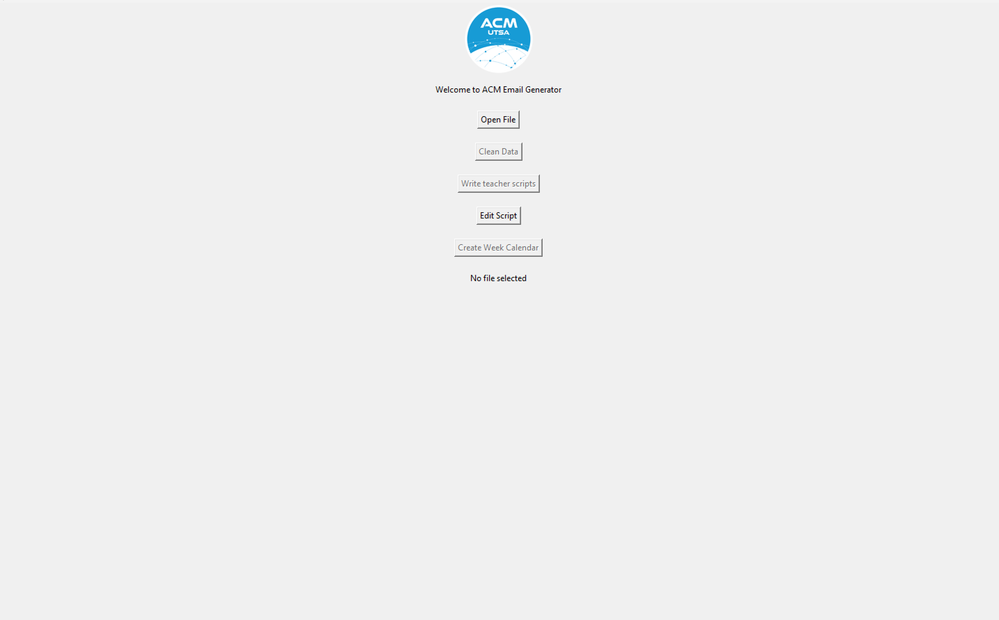
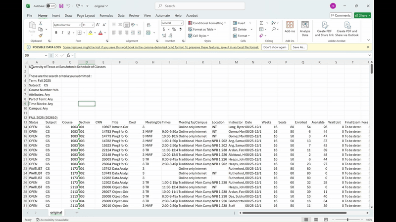

# ACM Email Script

## Description 📓 
A program designed for recieiving, cleaning, and transforming school schedule data into sendable email formats with teacher filenames and their classes at the bottom.

## How to use🛠️
- When you are sent the CSV data sheet it should include many columns including the important ones below...

Instructor | Title | Times | Meeting Days | Course| Campus

- While the columns shouldn't be in this order, make sure they are present

- Edit the dataset in any spreadsheet editor to remove any unwanted text above the header and below the final line of the dataset
 

- Make sure to do this as the program will not run correctly and crash otherwise

- Use the **open folder** to find your edited csv

-  **"Clean"** the data which will remove any classes that are "To Be Arranged", or have not had their desired teachers chosen and labeled "Staff"
  
- Prior to running the **generate scripts** button please make any edits to the script using the **edit script** 
  
- After making your edits then press the **write teacher script**
- TADA!! In the program file there should be a created folder called **teacher-files** that should have all of your .txt files

## Contributing 🤝
-Feel free to fork and add anything you seem fit. 
-This was a side project I designed for ACM UTSA. It has simple UI interfacing with some quick code, so I would love any improvements that would make the program accessible to more people.

## Contact 📞
-If you have any questions conact my discord **xhilgerz**
