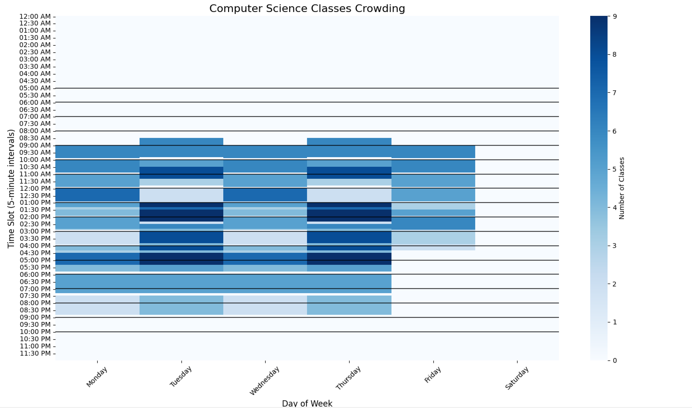

# 📧 ACM Email Script

**Automate teacher schedules + visualize classroom heatmaps**  
*A Windows tool to process school schedules and generate:*
- 📨 Personalized email scripts for teachers  
- 🔥 Weekly heatmaps (busiest/quietest class times)  

  
*↑ Now with heatmap visualization!*

---

## 🌟 Features

### 1. **Clean Data** 🧹
- Filters out:  
  - `"To Be Arranged"` classes  
  - Unassigned (`"Staff"`) instructors  
  - Online/async courses  

### 2. **Email Script Generator** ✍️
- Exports `.txt` files per teacher with:  
  - Class times 📅  
  - Locations 🏫  
  - Custom email templates  

### 3. **Weekly Heatmap** 🔥  
- **Visualize peak class times** with a color-coded calendar:  
  - 🟦**Blue** = Busiest hours (most classes)  
  - ⬜ **White** = Quietest hours  
- Helps optimize room allocations and member schedules.  

---

## 💾 Installation (Windows)

### ➡️ For End Users
1. Download the latest `.exe` from [Releases](https://github.com/your-repo/acm-email-script/releases).  
2. **Double-click to run** (no install needed).  

### ➡️ For Developers
bash
git clone https://github.com/your-repo/acm-email-script.git
cd acm-email-script
pip install -r requirements.txt  # pandas, matplotlib, etc.
python main.py 

---

## 🛠️ Usage

### Step 1
Instructor | Title | Times | Meeting Days | Course| Campus

While the columns shouldn't be in this order, make sure they are present
-Before Loading:
  -Remove any text above the headers or below the data rows
  -Ensure no blank rows/columns exist.
  

### Step 2
- Launch the .exe file
- Load the CSV:
  - Click **Open Folder** and select recieved preprocessed file
- Clean the Data
  - Click the **Clean** to remove the invalid entries (TBA,"Staff, async classes).

### Step 3: Generate Outputs

#### Option A: Email Scripts ✉️
- (Optional) Click Edit Script to customize the email template.
- Click Generate Scripts → Write Teacher Script.
- A teacher-files folder will appear, containing individual .txt files per instructor.

#### Option B: Weekly Heatmap 🔥
- Click Create Week Calendar.
- A heatmap.png file showing busy/quiet times (example below).

---

## Contributing 🤝
-Feel free to fork and add anything you seem fit. 
-This was a side project I designed for ACM UTSA. It has simple UI interfacing with some quick code, so I would love any improvements that would make the program accessible to more people.

---

## Contact 📞
-If you have any questions contact my discord **xhilgerz**
